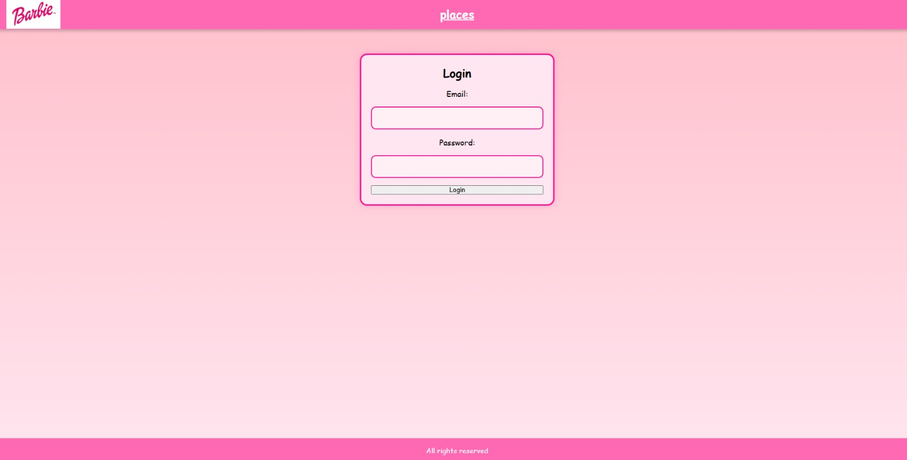
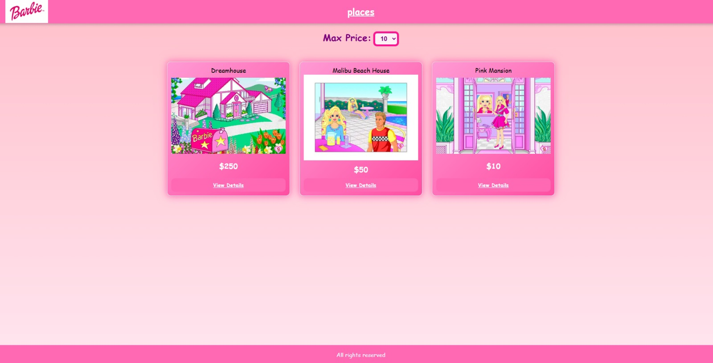
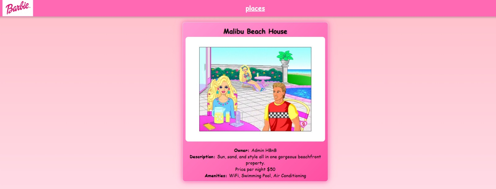
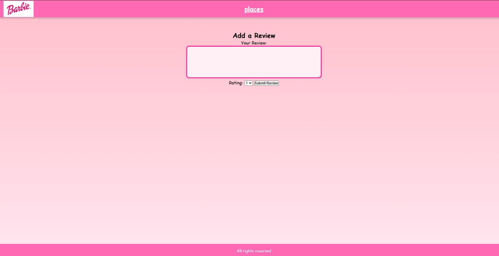
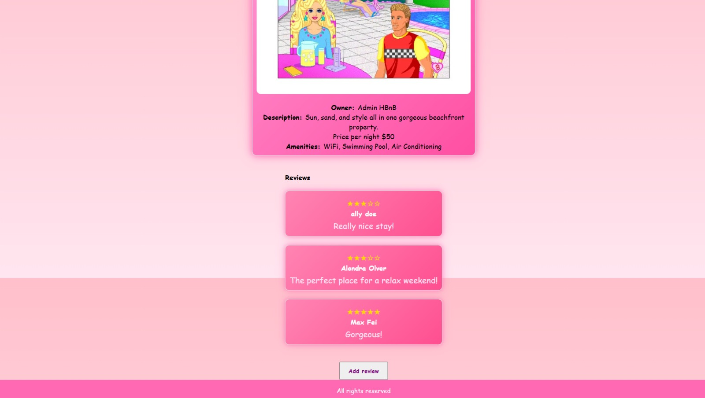

# 🏠 HBnB Project 

## Part 4 – Simple Web Client

n this phase, we focus on the front-end development of your application using HTML5, CSS3, and JavaScript ES6. The goal was to design and implement an interactive user interface that connects seamlessly with the back-end services developed in earlier parts of the project.

### 🧱 Project Summary
- Develop a user-friendly interface following provided design specifications.
- Implement client-side functionality to interact with the back-end API.
- Ensure secure and efficient data handling using JavaScript.
- Apply modern web development practices to create a dynamic web application.

### 🛠️ Tasks Breakdow

- **Design**: Complete HTML/CSS, build pages (Login, Places, Place Details, Add Review).
- **Login**: Implement API login, store JWT in cookies.
- **List of Places**: Fetch & display places, add country filter, redirect unauthenticated users.
- **Place Details**: Show details by ID, allow reviews if logged in.
- **Add Review**: Form for reviews, restrict to authenticated users.


#### Project Structure

```
v1/
|-- README.md
|-- app
|   |-- __init__.py
|   |-- api
|   |   |-- __init__.py
|   |   `-- v1
|   |       |-- __init__.py
|   |       |-- admin.py
|   |       |-- amenities.py
|   |       |-- auth.py
|   |       |-- places.py
|   |       |-- reviews.py
|   |       `-- users.py
|   |-- models
|   |   |-- __init__.py
|   |   |-- amenity.py
|   |   |-- base.py
|   |   |-- place.py
|   |   |-- review.py
|   |   `-- user.py
|   |-- persistence
|   |   |-- __init__.py
|   |   |-- amenity_repository.py
|   |   |-- place_repository.py
|   |   |-- repository.py
|   |   |-- review_repository.py
|   |   `-- user_repository.py
|   |-- services
|   |   |-- __init__.py
|   |   `-- facade.py
|   |-- static
|   |   |-- script_index.js
|   |   |-- script_login.js
|   |   |-- script_place.js
|   |   |-- script_review.js
|   |   |-- styles.css
|   |   `-- images
|   |-- templates
|   |   |-- add_review.html
|   |   |-- footer.html
|   |   |-- header.html
|   |   |-- index.html
|   |   |-- login.html
|   |   `-- place.html
|   `-- tests
|       |-- __init__.py
|       |-- api_unittest_amenity.py
|       |-- api_unittest_places.py
|       |-- api_unittest_review.py
|       |-- api_unittest_users.py
|       |-- class_model_amenity_test.py
|       |-- class_model_review_test.py
|       |-- class_models_place_test.py
|       |-- class_models_test.py
|       |-- doc_api_unittest_places.txt
|       |-- facade_unittest_amenity.py
|       |-- facade_unittest_places.py
|       |-- facade_unittest_review.py
|       `-- facade_unittest_user.py
|-- config.py
|-- entity_relationship_diagram.svg
|-- requirements.txt
|-- run.py
|-- seed_admin_amenities.sql
|-- sql
|     |-- create_database.sql
|     `-- test_operations.sql
| -- instance
      `-- development.db
```
### Requirements

- Python 3.x
- Flask
- Flask-RESTX
- Flask-JWT-Extended
- Flask-Bcrypt
- SQLAlchemy
- SQLite (for development) / MySQL (for production)

### 🛠️ Installation and running
#### Clone the repository and make sure to have python3 installed
```bash
git clone https://github.com/andreamgrs/holbertonschool-hbnb.git
cd holbertonschool-hbnb
```

#### Install requirements
Navigate to the part3 directory, folder v1. 
```bash
cd part3/v1
pip install -r requirements.txt
```

#### To initialize the database and create the table, run:
```bash
python3 -m flask --app run shell
>>> from app import db
>>> db.create_all()
>>> exit()
```

##### Populate tables with initial data
To perform the tests, you must be logged in as an admin user. This step seeds the admin_user data to enable testing for these tasks.
```bash
apt update then
apt install sqlite3-y then
sqlite3 instance/development.db < seed_admin_amenities.sql
```

#### Run the application inside v1

```bash
python3 run.py
```

The API will now be running at:
```bash
http://127.0.0.1:5000/api/v1/
```
### For Testing Our webpage
This guide explains how to test the web client and interact with the back-end API.

#### 🔑 Authentication
- To access features like adding reviews, you must be logged in as a user.
- Login via the API endpoint:
```bash
http://127.0.0.1:5000/api/v1/auth/login
```
- If you are not logged in, the Review button will not appear.

#### 🌍 Navigating the Webpage
- Browse through the list of places.
- Click on a place to view its details.
- If authenticated, you will see the option to add a review.
- You can only review places that you do not own.

#### 👤 Creating New Users
New users must be created via cURL or a POST request to the API.
**Example* Create a User**
```bash
curl -X POST "http://127.0.0.1:5000/api/v1/users/" -H "Authorization: Bearer <admin_token>" -H "Content-Type: application/json" -d '{
   "first_name": "Ally",
    "last_name": "Doe",
    "email": "ally@example.com",
    "password": "your_password1",
    "is_admin": false
}'
```
#### 🔐 Getting the Admin Token
To create users, you need an Authorization Token from the seeded admin account.
**Example: Get admin token fro creating new users**
```bash
curl -X POST "http://localhost:5000/api/v1/auth/login" \
-H "Content-Type: application/json" \
-d '{
   "email": "admin@hbnb.io",
   "password": "admin1234"
}'
```
This request will return a JWT token. Use this token in the **Authorization: Bearer <admin_token>** header when creating new users.

### 📸 Application Screenshot
#### Login Form
**Go with -> http://127.0.0.1:5000/api/v1/auth/login**



#### List of places
**Go with -> http://127.0.0.1:5000/api/v1/index**



#### Place Details
**Go with -> http://127.0.0.1:5000/api/v1/place?id=<place_id>**



#### Add review form
>Go with -> http://127.0.0.1:5000/api/v1/add_review?id=<place_id>



#### Place details with review form
**Go with -> http://127.0.0.1:5000/api/v1/place?id=<place_id>**




## 👥 Contributors
- Thannie Phan
- Sheeny Soulsby
- Andrea Munoz
